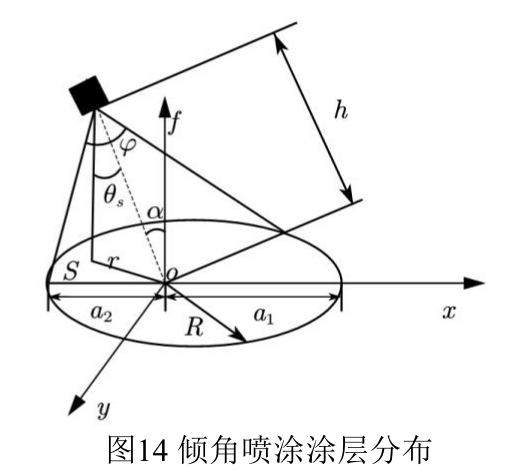
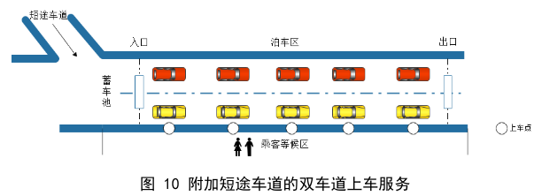
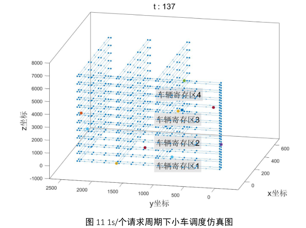
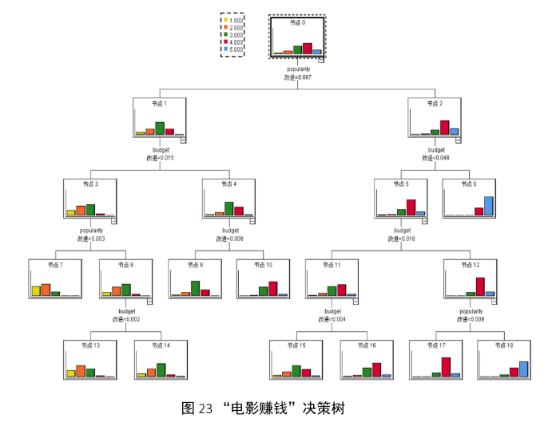
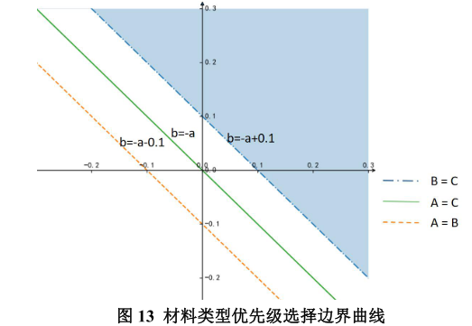

# 数学建模竞赛

[**数学模型**](https://zh.wikipedia.org/zh-cn/数学模型)使用数学来将一个系统简化后予以描述，常见的模型包括最优化模型、动力系统、概率模型等。通常情况下，数学模型可被分为以下几类：

- 线性与非线性
- 静态与动态
- 显式与隐式
- 离散与连续
- 确定性与概率性（随机性）
- 演绎，归纳与漂移

**全国大学生数学建模竞赛**与其他数学竞赛相比着重强调研究问题、解决方案的原创性、团队合作、交流以及结果的合理性。竞赛以三人为一组，在四天时间内，就指定的问题完成从创建模型、求解、验证到论文撰写的全部工作。竞赛每年都吸引大量著名高校参赛。创办于1992年，每年一届，是首批列入“高校学科竞赛排行榜”的19项竞赛之一。

### 参赛记录

| 题目                                                         | 模型                                                         |                      |
| ------------------------------------------------------------ | ------------------------------------------------------------ | -------------------- |
| [2021.5 校赛A题：最优喷涂问题](./第21届校赛A题：最优喷涂问题/A题：最优喷涂问题.pdf) | [复杂物体表面最优喷涂模型的研究](./第21届校赛A题：最优喷涂问题/复杂物体表面最优喷涂模型的研究.pdf) |  |
| [2021. 6 国赛C题：机场的出租车问题](./2019国赛C题：机场的出租车问题/CUMCM-2019-Problem-C-Chinese.pdf) | [基于排队论的机场出租查选择与调度研究](./2019国赛C题：机场的出租车问题/基于排队论的机场出租查选择与调度研究.pdf) |  |
| [2021.7 集训题：轨道小车调度问题](./第一轮集训问题：轨道小车调度问题/赛题设计：轨道小车调度问题.pdf) | [基于路径规划和状态机的轨道小车调度研究](./第一轮集训问题：轨道小车调度问题/基于路径规划和状态机的轨道小车调度研究.pdf) |  |
| [2021.8 集训题：观影数据集之大数据分析](./第二轮集训问题：观影数据集之大数据分析/观影数据集之大数据分析.pdf) | [基于神经网络和决策树的电影预测与决策分析](./第二轮集训问题：观影数据集之大数据分析/基于神经网络和决策树的电影预测与决策分析.pdf) |  |
| [2021.9 国赛C题：生产企业原材料的订购与运输](./2021国赛C题：生产企业原材料的订购与运输/CUMCM2021-C.pdf) | [基于非线性优化和 0-1 整数规划的订购转运方案研究](./2021国赛C题：生产企业原材料的订购与运输/基于非线性优化和0-1整数规划的订购转运方案研究.pdf) |  |

### 队友

嵇涵琦、黄心宇、薛凯文

### 指导老师

李厚彪

### 后记

相比建模能力的提升，那些一起彻夜通宵战斗的夜晚更多的是赋予了我不轻言放弃的品质。在此感谢队友的陪伴和老师的教导。